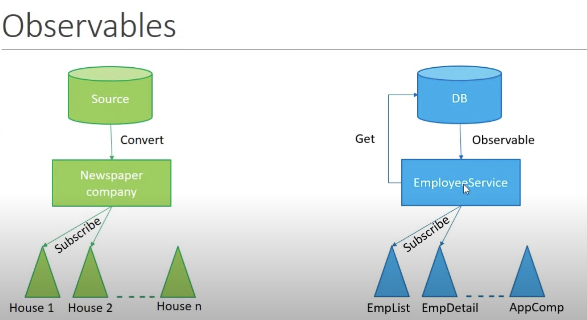

b# Angular
- To create a project : `ng new project-name`
- To create a component :`ng generate component component-name`
- To run the project : `ng serve`
  
## Angular structure
- 'main.ts' is the entry to the root module that app module
- All the created components can be found in root module
- App flow:main.ts -> app module -> app.module.ts -> app.component.ts
  
## Modules
- Angular app is a collection of many individual modules
- Modules represent the feature a feature area in the Appilication
  `eg: usermodule, adminmodule`
- Each module internally made of components and services
  
## Components 
- A component controls the portion of the view in the browser
- eg : we can have a component for sidebar, header
  


- component is made of 3 parts
    - template(View HTML)
    - class (code, typescript & data methods)
    - metadata (information , decorator)
  
    

- component decorartor has the template and style 
- eg : @Component({
    selector: 'app-test-comp',<br/>
    templateUrl: './test-comp.component.html',<br/>
    styleUrls: ['./test-comp.component.css'],<br/>
     })
     - Selector : is used to represent this component
     - templateUrl : points to the hmtl template view
     - styleUrls : styles that point to this component
- To add component anywhere add as a custom tag `<app-test-comp></app-test-comp>`
- can be used as a class by adding "." in selector `<div class="app-test-comp"></div>`
- use as html attribute `<div app-test-comp></div>`
- Each component we have
  - HTML template + class(to control logic)
- services: contain business logic 
  
    

## Interpolation
- binding data from class to a template
- syntax: `<h1>{{name}}</h1>`
- we can use javascript functions in {{}}
- we can call functions in {{}}
- we cannot assign variable and use global variables

## Property binding
- Binding value to the property of DOM element
- `<input [id]="myId" type="text" value="raj" />`
- `<input [disabled]="isDisabled" id="{{ myId }}" type="text" value="raj" />`
- 
  

## Class binding
- Binding the property to a class
- `<h2 [class]="successClass">Codevolution</h2>`
- If we want to apply for multiple classes we use `ngClass` directive</br>
  `<h2 [ngClass]="messageClasses">Message</h2>`

## Style binding
- This is used to bind inline styles for html elements
- We can use conditional property to bind style
- component class properties during binding
- `ngStyle` directive is used to apply multiple styles
  
## Event binding
- Captures some dom event and performs an action
- $event is variable that gives info about dom event that is raised
- Binding data on user events</br>
  `<button (click)="onClick($event)">Greet</button>`

  

## Template reference variable
- When there is an user interaction we want data to flow from template to class eg:- require value of an input field to perform validation</br>
  
    <input #myInput type="text" /></br>
    <button (click)="logMessage(myInput.value)">Log</button></br>

- `#myInput` is a template variable which can be passed to the event
-  reference variable can be used to refer to an html element and all of its DOM properties

## Two way binding
- Model and View should always be in sync 
- For example if a user has login form and fills out the values these values are added to the property where there is a change in property the views values should be updated
- two way binding allows us to update the property and view the property at same time
- it provides a directive `ngModel`

## Structural directives
- Structural directives let us add or remove HTML elements
- eg : `ngIf`  `ngSwitch`  `ngFor`
  
- ngIf:- Assign a truthy value that conditionally renders the element and it    removes the element from DOM </br>
    `<h2 *ngIf="true">code evolution</h2>`
- ngIf various forms: <br/>
  ```<div *ngIf="condition; else elseBlock"> and <ng-template #elseBlock>```<br/>
  ```<div *ngIf="condition; then thenBlock else elseBlock"></div>``` (we will have two blocks with <ng-template> tag)   
  
- ngSwitch : we want to compare against multiple values
- eg:- <some-element [ngSwitch]="color"></br>
        <some-element *ngSwitchCase="'red'">You picked red color</some-element><br/>
        <some-element *ngSwitchCase="'blue'">You picked blue color</some-element><br/>
        <some-element *ngSwitchCase="'green'">You picked green color</some-element><br/>
        <some-element *ngSwitchDefault>Pick again</some-element>
      </some-element><br/>
- ngFor:- Loops through the elements 
   eg:- `<div *ngFor="let color of colors; index as i">
          <h2>{{ i }} {{ color }}</h2>
        </div>`

## Component interactions
- parent and child components interact with each other using `@input()` and `@output()` decorators
- `@input()`: is used send data from parent to child component<br/>
   - syntax: @Input() item = ''; (item is the value from parent component)<br/>
   - import input from angular core (`@angular/core`)
   - declare a property in child component and bind it to the custom tag of <br/>child component and access it in parent component by using @input()
  
- `@Output()` : A child component sends data to parent component using events we create and instance of EventEmitter and emit in the class and listens to the event in child component and pass it to parent component
- syntax: `@Output() childEvent = new EventEmitter<string>();`<br/>
   - child component : `<app-test (childEvent)="message=$event" [parentData]="name"></app-test>`
  


## Pipes
- We can use pipes to transform strings, currency amounts, dates, and other data for display
- eg : ```<h2>{{ 'Codevolution' | lowercase }}</h2>```
- There are any built-in pipes in angular like DatePipe, CurrenyPipe, PercentPipe

## Services
- A class with a specific purpose
  - 1)Share data across multiple components
  - 2)implement appilication logic
  - 3)external interaction like connecting to DB
- Naming convention - `.service.ts`
- We can use a service using Dependency Injection

## Dependency Injection


- Dependency injection has a `injector` where we register all our dependencies


- We need to register a class at App module so that all the components can access the dependencies
- First we need to create a service class
- Then we need to register that service to the injector mostly at the App module
- Then we can access the dependices of the injector by initializing them in the constructor and import that service
  
 ``` 
 constructor(private _employeeService: EmployeeService) {}

  ngOnInit() {
    this.employees = this._employeeService.getEmployess();
  }
  ````

  

 

## http and observables
- HTTP mechanism
  
   

#Observable:
- A Sequence of items that arrive asynchronously over time.
- Http call - single item that is `single item` is `Http response`
  
- This an http response that arrives asynchronously
- The response that is returned by http service is observable.
   
  

- Import `HttpClinet` module in App module and add it to imports
- Declare it as a dependency in constructor of the service.
- Now we need to make a http request and this request will return an observable and we need to cast this observable.eg: create an employee interface and we need `subscribe` to this observable in the component to get the data
- we make use of `catch` to handle errors thrown by observable
- error handling : first we to add catch operator on the observable and write a error handler to throw the exception out and in the components which subscribed to the observable we can get error  

  


  
 